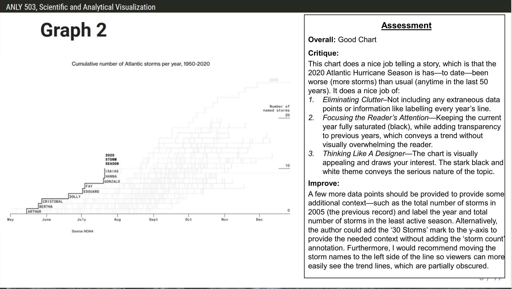
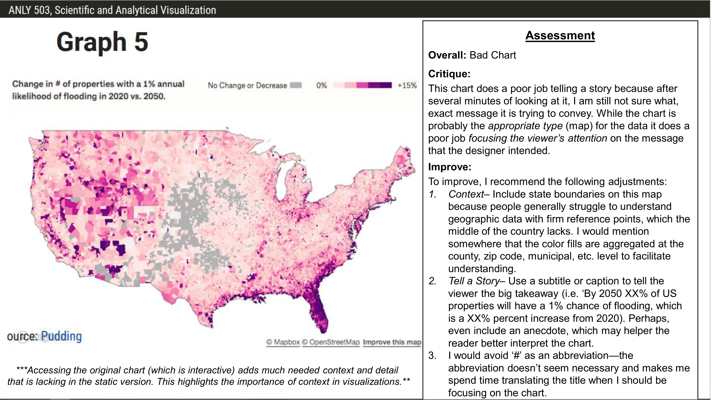
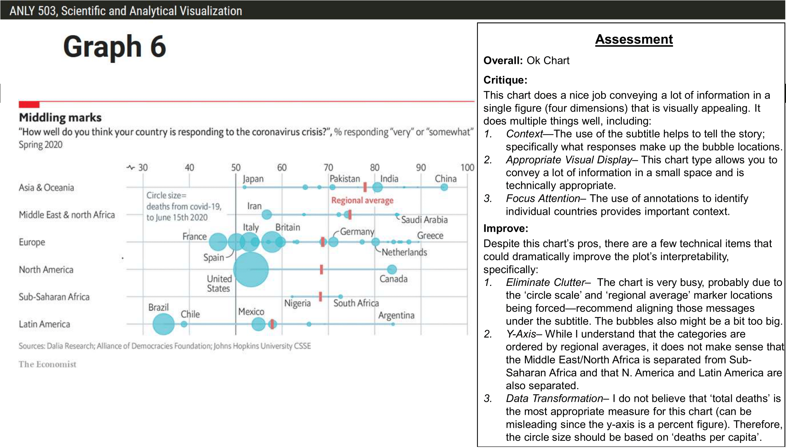
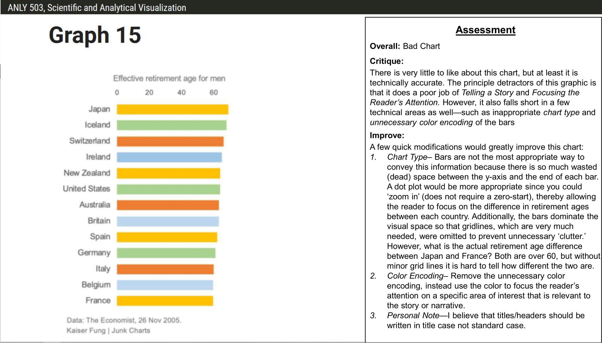

<em> This assignment required students to provide techical and visual critiques for three publically available graphic. Note, the graph numbers correspond to the randomly assigned charts, which were randomly assigned.  </em>
  

### NOAA: Hurricane Chart

  

### Unknown: Property Flooding

  

### Economist: COVID Response

  

### Unknown: Retirement Ages
