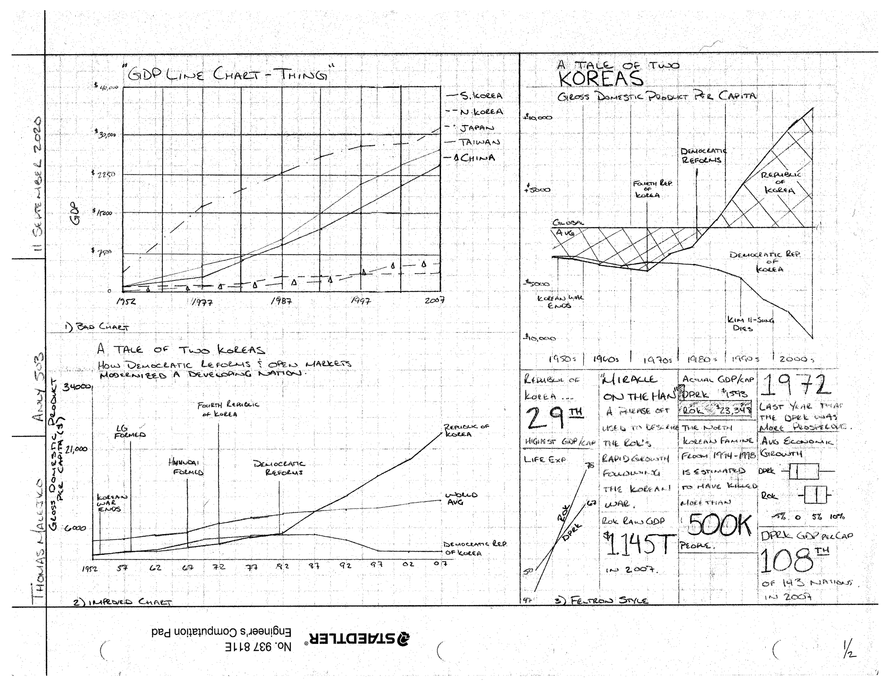
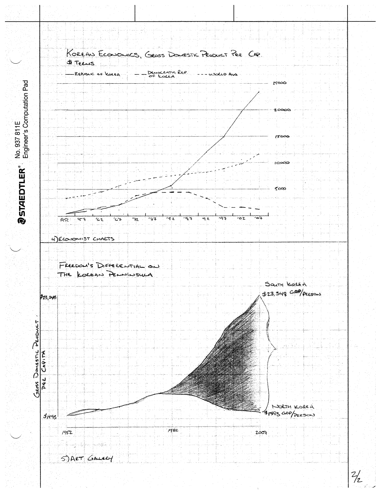

<em> Make It Ugly, Then Make It Better! This assignment required students to find a data story in the Gapminder dataset. then generate five charts with the following aestetics: ugly, clean, Nicolas Felton, news publication, and art gallery. </em>
 

### The Final Products...

