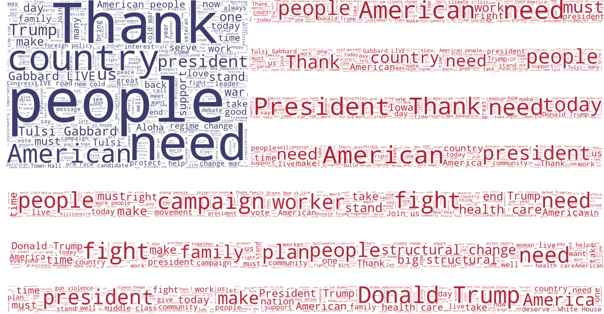
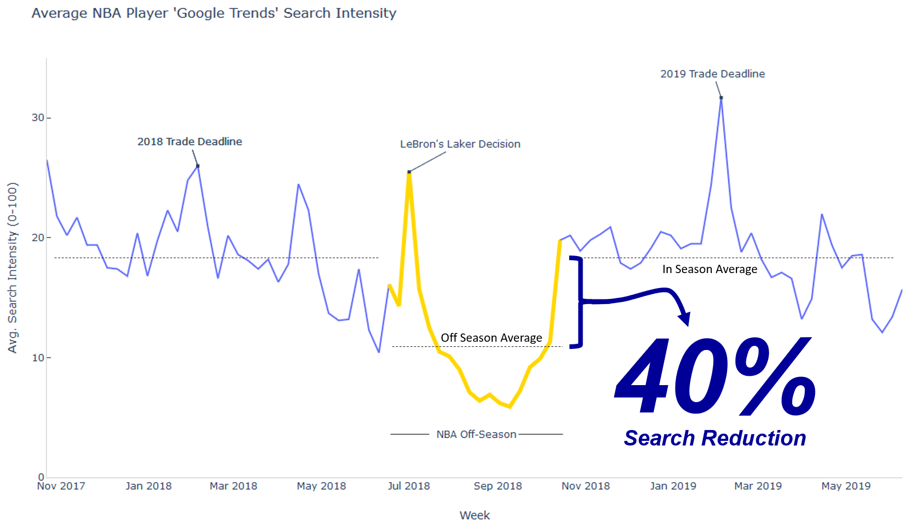

<em> This section that highlights some of the more interesting and unique visualizations in my professional porfolio. </em>

### Word Cloud



<em> A custom word cloud (created using Python), depicting the tweets of the seven most prominent 2020 Democratic presidential hopefuls from the start of the main campaign season to Super Tuesday. Each stripe represents a single candidate’s tweets and the blue field is the field combined. Can you guess which stripe belongs to a candidate (answers at the bottom of the page). </em>

### Interactive Network Diagram

```{r network-prep, echo = FALSE, warning = FALSE, message = FALSE, results='hide'}
library(networkD3)
library(dplyr)
library(arules)

tweetDF <- read.csv('data/cleanedCongressTweetsFloyd.csv',
                    stringsAsFactors = FALSE)

transFile <- 'congressFloydTweets.csv'

trans <- file(transFile)
tokens <- tokenizers::tokenize_words(tweetDF$CleanTweet[1],
                                     stopwords = stopwords::stopwords('en'),
                                     lowercase = TRUE,
                                     strip_punct = TRUE,
                                     simplify = TRUE)

cat(unlist(tokens), '\n', file = trans, sep = ',')
close(trans)

trans <- file(transFile, open = 'a')

for (i in 2:nrow(tweetDF)){
  tokens <- tokenizers::tokenize_words(tweetDF$CleanTweet[i],
                                     stopwords = stopwords::stopwords('en'),
                                     lowercase = TRUE,
                                     strip_punct = TRUE,
                                     simplify = TRUE)

  cat(unlist(tokens), '\n', file = trans, sep = ',')
}

close(trans)

tweetDF <- read.csv(transFile, header = FALSE, stringsAsFactors = FALSE)

tweetDF[tweetDF == "rt"]  <- ''
tweetDF[tweetDF == 'amp'] <- ''

dropDF <- NULL

for (i in 1:ncol(tweetDF)){
  for (j in 1:nrow(tweetDF)){
    if (nchar(tweetDF[j,i]) < 4 | nchar(tweetDF[j,i]) > 12){
      tweetDF[j,i] <- ''
    }
  }
}

write.table(tweetDF, file = "updatedCongressFloydTweets.csv", col.names = FALSE, 
            row.names = FALSE, sep = ",")

tweetTrans <- read.transactions("updatedCongressFloydTweets.csv", sep =",", 
                                format("basket"),  rm.duplicates = TRUE)

tweetRules <- arules::apriori(tweetTrans, parameter = list(support=.02, 
                                                           conf=.25, 
                                                           minlen=2, 
                                                           maxlen =2))

rulesSorted <- sort(tweetRules, by = 'confidence', decreasing = TRUE)

ruleDF <- DATAFRAME(rulesSorted, separate = TRUE)

ruleDF$LHS <- as.character(ruleDF$LHS)
ruleDF$RHS <- as.character(ruleDF$RHS)

ruleDF[] <- lapply(ruleDF, gsub, pattern = '[{]', replacement = '')
ruleDF[] <- lapply(ruleDF, gsub, pattern = '[}]', replacement = '')

linkDF <- ruleDF[c(1,2,3)]
names(linkDF) <- c('source', 'target', 'weight')

sources <- linkDF %>% distinct(source) %>% rename(label = source)
target  <- linkDF %>% distinct(target) %>% rename(label = target)

nodes <- full_join(sources, target, by = 'label')

nodes['id'] <- as.integer(rownames(nodes)) - 1

edges <- linkDF %>% left_join(nodes, by = c('source' = 'label')) %>% rename(from = 'id')
edges <- edges %>% left_join(nodes, by = c('target' = 'label')) %>% rename(to = 'id')

edges <- select(edges, from, to, weight)

nodes$group <- 1

protestList <- c('georgefloyd', 'brutality', 'police', 'racism', 'murder', 'violence',
                 'peaceful', 'system', 'america', 'police', 'brutality',
                 'systemic', 'justice')

prideList <- c('pridemonth', 'equality', 'fighting', 'lgbtq', 'community', 
               'pride', 'stonewall', 'rights', 'celebrate', 'fight', 'work')

#https://www.jessesadler.com/post/network-analysis-with-r/

for (i in 1:nrow(nodes)){
  if (nodes[i, 'label'] %in% protestList){
    nodes[i, 'group'] <- 2
  } else if (nodes[i, 'label'] %in% prideList) {
    nodes[i, 'group'] <- 3
  }
}

my_color <- 'd3.scaleOrdinal() .domain([1, 2, 3]) .range(["#A4C639", "#3B444B", "#BD33A4"])'

countL <- data.frame(table(ruleDF$LHS))
countR <- data.frame(table(ruleDF$RHS))

counts <- left_join(countL, countR, by = 'Var1')

counts$count <- rowSums(counts[,c("Freq.x", "Freq.y")], na.rm=TRUE)

counts$Freq.x <- counts$Freq.y <- NULL
counts$label <- as.character(counts$Var1)
counts$Var1 <- NULL

nodes <- full_join(nodes, counts, by = 'label')

```
```{r plot-networks, echo = FALSE, fig.align='center', fig.width = 10}
forceNetwork(Links = edges, Nodes = nodes, Source = 'from', Target = 'to',
             NodeID = 'label', colourScale=my_color, Group = 'group', Value = 'weight',
             Nodesize = 'count', opacity = .8, fontSize = 16, zoom = TRUE)
```

<em> An interactive network diagram (created using NetworkD3 in R) depicting the relationship between words appearing in tweets from congressional leaders from 31 May to 2 June 2020. The relationship between words were calculated using Association Rule Mining. The three colors correspond to the three topics of the tweets (COVID-19, George Floyd Protests, and Pride Month), while the node size is based upon its degree. </em>

### Geospatial
```{r, echo = FALSE, warning = FALSE, message = FALSE, results='hide'}
#load libraries and set global conditions
library(tigris)
library(leaflet)
library(tidyverse)

options(scipen = 999)
options(tigris_use_cache = TRUE)

##load the tigris files for zip codes (TAKES TIME) for the NCR BAH region
char_zips <- zctas(cb = TRUE, starts_with = c('20', '22', '56'))

##retreive the income information from the IRS for 2017 & check import
irsDF <- read_csv('https://www.irs.gov/pub/irs-soi/17zpallnoagi.csv')
head(irsDF)

##calculate the mean income by zip code
##N02650: Number of Returns (Count) & A02650: Gross Income Amount (Thousands $)
subDF <- irsDF %>% select(ZIPCODE, N02650, A02650) %>% 
  rename(returns = N02650, income = A02650) %>% 
  mutate(income = income*1000,
         mean_income = income/returns) %>% 
  arrange(desc(mean_income)) %>% 
  select(ZIPCODE, mean_income)

##filter the subDF to only zipcodes within the NCR BAH region
bahDF <- read_csv('C:\\Users\\armyk\\OneDrive\\Documents\\General Programming\\BAH\\BAH_DCZips.csv', 
                  col_names = c('ZIPCODE', 'BAH_REGION'))

bahDF$ZIPCODE <- as.character(bahDF$ZIPCODE)

subDF <- left_join(subDF, bahDF, by = "ZIPCODE")

subDF <- subDF[complete.cases(subDF), ]

##join the data
char_zips <- geo_join(char_zips, subDF, by_sp = 'GEOID10',
                      by_df = 'ZIPCODE', how = 'inner')

##initialize variables and conditions for mapping
# pal <- colorNumeric(palette = 'Greens', domain = char_zips$mean_income)
pal <- colorNumeric(palette = 'Spectral', domain = char_zips$mean_income, 
                    reverse = TRUE)

labels <- paste0('Zip Code: ', char_zips@data$GEOID10, "<br/>",
                 'Mean Income: ', 
                 scales::dollar(char_zips@data$mean_income)) %>% 
  lapply(htmltools::HTML)
```
```{r generate-map, echo=FALSE, warning = FALSE, message = FALSE, fig.width = 10, fig.align='center'}
##create the map
char_zips %>% leaflet %>% 
  #add base map
  addProviderTiles('CartoDB') %>% 
  #add zip codes
  addPolygons(fillColor = ~pal(mean_income), weight = 1.5, opacity = 1,
              color = '#F2F3F3', dashArray = '2', fillOpacity = .75,
              highlight = highlightOptions(weight = 2, color = '#666', 
                                          dashArray = '', fillOpacity = .7,
                                          bringToFront = TRUE),
              label = labels) %>% 
  #add legend
  addLegend(pal = pal, values = ~mean_income, opacity = .7, 
            title = htmltools::HTML('Mean Income<br>
                                    by Zip Code <br>
                                    2017'),
            position = 'bottomright')
```
<em> A visual graphic highlighting the annual household income (as reported by the IRS) in the Washington D.C. Metro Area. </em>

### Static Time Series



<em> A static time series graphic (created using Python), which looks at the average weekly NBA player search frequency on Google.  </em>
<br><br><br>

*Flag Word Cloud Order (Top to Bottom)*: Mr. Tom Steyer, Rep. Tulsi Gabbard, Sen. Amy Klobuchar, Mayor Pete Buttigieg, Sen. Bernie Sanders, Sen. Elizabeth Warren, and V.P. Joe Biden.


